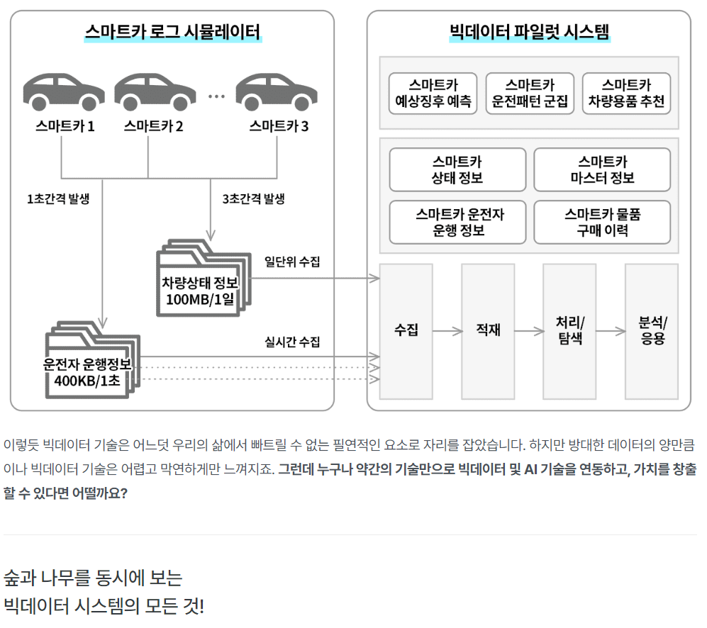

# **빅데이터 파일럿 프로젝트 개요**

---

인프런에서 유익하게 들었던 강의 기간이 끝나가면서 복습 차원에서 블로그로 정리하고자 함 . 

> https://www.inflearn.com/course/%EB%B9%85%EB%8D%B0%EC%9D%B4%ED%84%B0-%ED%8C%8C%EC%9D%BC%EB%9F%BF-%ED%94%84%EB%A1%9C%EC%A0%9D%ED%8A%B8

 

 

**버추얼박스(VM)** 및  **클라우데라(CLOUDERA)** 위에서 **하둡 에코시스템** 등을 간편하게 설치하고 **실습**해 봄으로써

설치에 대한 부담없이 하둡 시스템등을 이해하고 공부하기 좋음.

---

프로젝트에 큰 개요는 강의 설명에 나와 있는 아래 그림으로 대체 

