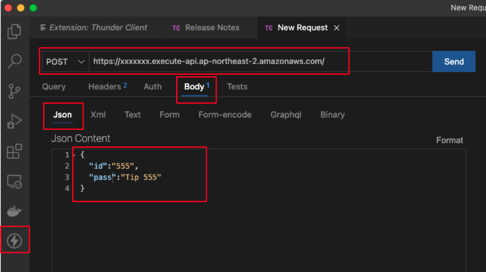

# REST API with Curl, Thunder Client

GET : DATA READ

POST : CREATE 정보 추가 

PUT/PATCH : UPDATE 

​	PUT: 통째로 갈아 끼울떄 , PATCH : 일부수정

DELETE : 삭제 

### 1. curl 사용 Test

curl http://localhost:3000/  -X POST -d '{"id":"pppsh","pass":"1234"}' -H  "Content-Type: application/json"

-d '{"id":"pppsh","pass":"1234"}' :  내가 넘기는 데이터 

-H  "Content-Type: application/json" :  내가 요청하는 데이터 타입 

 

## 2. VS Code의 Thunder Client

별도의 프로그램 설치 없이 , vscode에 extension 추가로 사용가능

위 그림 왼쪽 하단에 1) 위 사진 왼쪽 하단 번개 표시 , 2) GET, POST방식 선택, 3) URL 입력, 4) Body에 넘기는 데이터 정의(Json) 