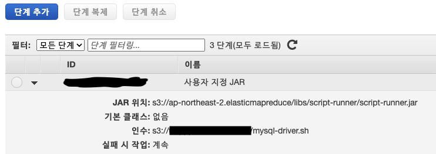

# Zeppelin JDBC 추가 

1. 클러스터 목록 

2. 단계 

3. 단계 추가 

   **JAR 위치:**

   ```bash
   s3://ap-northeast-2.elasticmapreduce/libs/script-runner/script-runner.jar
   ```




4. Zeppelin 우측 상단에 anonymous -> Interpreter
4. 제일 하단에 spark restart
